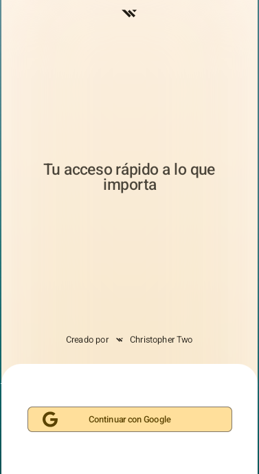
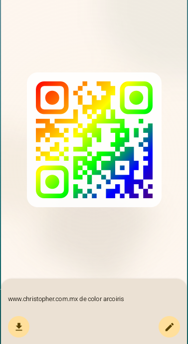
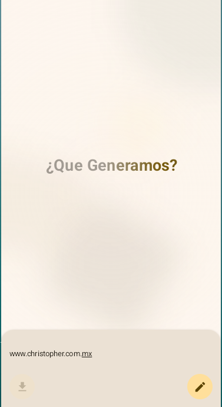

# Lumi

<p align="center">

  
  
</p>

<p align="center">
  <a href="https://drive.google.com/file/d/1f_verOaHLXyKWGk_rHEip5YCCZDS2VmC/view?usp=sharing">
    
  </a>
</p>


Esta es una aplicación avanzada de escáner y generador de códigos QR para Android, creada con Jetpack Compose. Utiliza inteligencia artificial a través de la API de Gemini para generar códigos QR personalizados y cuenta con autenticación de usuarios mediante Firebase.

## Características

*   **🔐 Autenticación de usuarios:** Sistema completo de inicio de sesión con Google utilizando Firebase Authentication. La sesión se mantiene persistente entre reinicios de la aplicación.
*   **📷 Escáner de códigos QR:** Escanea códigos QR y códigos de barras con la cámara de tu dispositivo. Utiliza ML Kit de Google para un reconocimiento rápido y preciso.
*   **✨ Generador de códigos QR con IA:** Genera códigos QR personalizados usando lenguaje natural. Describe lo que quieres y la IA de Gemini interpretará tu solicitud para crear el código QR con los colores y estilos que especifiques.
*   **🎨 Temas dinámicos:** Soporte para temas personalizados utilizando Material Kolor, adaptándose a las preferencias del usuario.
*   **📝 Reconocimiento de texto (OCR):** Además de códigos QR, la aplicación puede reconocer y extraer texto de imágenes usando ML Kit.
*   **💾 Descarga de códigos QR:** Guarda los códigos QR generados directamente en la galería de tu dispositivo.
*   **🎯 Interfaz de usuario moderna:** Construida completamente con Jetpack Compose para una experiencia fluida y receptiva.
*   **🏗️ Arquitectura limpia:** Código organizado siguiendo los principios de Clean Architecture con separación clara entre capas (Presentación, Dominio, Datos).
*   **💉 Inyección de dependencias:** Utiliza Koin para una gestión eficiente de dependencias.

## Arquitectura

El proyecto sigue una arquitectura limpia en capas:

*   **Presentation:** ViewModels, Screens y componentes de UI con Jetpack Compose
*   **Domain:** Casos de uso (UseCases) y modelos de dominio
*   **Data:** Repositorios, implementaciones y fuentes de datos (Firebase, DataStore, Gemini AI)

## Tecnologías utilizadas

### Core
*   **Jetpack Compose** - Framework moderno de UI declarativa
*   **Kotlin** - Lenguaje de programación principal
*   **Kotlin Coroutines** - Programación asíncrona
*   **Kotlin Serialization** - Serialización de datos JSON

### Inyección de Dependencias
*   **Koin** - Framework de inyección de dependencias ligero

### Firebase
*   **Firebase Authentication** - Autenticación de usuarios
*   **Firebase AI (Gemini)** - Integración con la API de Gemini para generación inteligente de QR

### Machine Learning
*   **ML Kit Barcode Scanning** - Escaneo de códigos QR y códigos de barras
*   **ML Kit Text Recognition** - Reconocimiento óptico de caracteres (OCR)

### Cámara
*   **CameraX** - API moderna de cámara de Android

### UI/UX
*   **Material 3** - Componentes de Material Design
*   **Material Kolor** - Generación dinámica de esquemas de color
*   **Compose Icons (Font Awesome)** - Biblioteca de iconos
*   **Compose Rich Text** - Renderizado de texto enriquecido y Markdown

### Almacenamiento
*   **DataStore Preferences** - Almacenamiento persistente de preferencias y sesión de usuario

### Utilidades
*   **qrose** - Generación personalizada de códigos QR
*   **Accompanist Permissions** - Manejo de permisos en tiempo de ejecución
*   **Navigation Compose** - Navegación entre pantallas

## Cómo compilar y ejecutar

1.  **Clona el repositorio:**
    ```bash
    git clone https://github.com/christopher-two/Qr.git
    cd Qr
    ```

2.  **Configura Firebase:**
    *   Crea un proyecto en [Firebase Console](https://console.firebase.google.com/)
    *   Agrega una aplicación Android con el package name `org.christophertwo.qr`
    *   Descarga el archivo `google-services.json` y colócalo en la carpeta `app/`
    *   Habilita **Authentication** en Firebase Console y activa el proveedor de Google Sign-In
    *   Copia el **Web client ID** de tu configuración OAuth 2.0

3.  **Configura las credenciales locales:**
    *   Crea un archivo `local.properties` en la raíz del proyecto si no existe
    *   Agrega tu clave de API de Gemini (obtén una en [Google AI Studio](https://aistudio.google.com/)):
    ```properties
    gemini.key=TU_API_KEY_DE_GEMINI
    ```
    *   Agrega el Web client ID de Firebase en `app/src/main/res/values/strings.xml`:
    ```xml
    <string name="web_id">TU_WEB_CLIENT_ID_DE_FIREBASE</string>
    ```

4.  **Abre en Android Studio:**
    *   Abre Android Studio y selecciona "Abrir un proyecto existente"
    *   Navega hasta el directorio del proyecto y haz clic en "Aceptar"
    *   Espera a que se descarguen todas las dependencias

5.  **Ejecuta la aplicación:**
    *   Conecta tu dispositivo Android (SDK 31+) o inicia un emulador
    *   Haz clic en el botón "Run" en Android Studio

## Cómo funciona

### Autenticación con Google

Al abrir la aplicación por primera vez, se te presentará una pantalla de inicio de sesión. La aplicación utiliza Firebase Authentication para gestionar el inicio de sesión con Google. Una vez autenticado, tu sesión se guarda localmente usando DataStore, por lo que no tendrás que iniciar sesión cada vez que abras la app.

### Generación de códigos QR con IA

La función de generación utiliza la API de Gemini (a través de Firebase AI) para interpretar indicaciones en lenguaje natural. Por ejemplo:

- "Un código QR para mi sitio web https://ejemplo.com con puntos azules"
- "Genera un QR con mi email contacto@ejemplo.com en color verde"
- "Crea un código QR con mi número de teléfono +1234567890"

La IA procesa tu solicitud y devuelve un objeto estructurado con:
- El contenido del QR
- Los colores personalizados (foreground y background)
- El estilo visual

Luego, la biblioteca `qrose` genera el código QR con estas especificaciones.

### Escaneo de códigos QR

Utiliza la cámara del dispositivo con CameraX y ML Kit para detectar y decodificar códigos QR y códigos de barras en tiempo real. La aplicación muestra una vista previa de la cámara y cuando detecta un código, muestra automáticamente su contenido.

## Permisos requeridos

*   **CAMERA** - Para escanear códigos QR
*   **INTERNET** - Para comunicación con Firebase y Gemini AI
*   **READ_MEDIA_IMAGES** - Para guardar códigos QR generados

## Requisitos del sistema

*   Android SDK 31 (Android 12) o superior
*   Cámara trasera con enfoque automático (recomendado)
*   Conexión a Internet

## Estructura del proyecto

```
app/src/main/java/org/christophertwo/qr/
├── core/           # Utilidades comunes y temas
├── data/           # Repositorios e implementaciones
│   ├── auth/       # Autenticación con Google
│   ├── session/    # Gestión de sesiones de usuario
│   ├── repository/ # Interfaces de repositorios
│   └── impl/       # Implementaciones de repositorios
├── domain/         # Lógica de negocio
│   ├── model/      # Modelos de dominio
│   └── usecase/    # Casos de uso
├── presentation/   # Capa de presentación
│   ├── screen/     # Pantallas (Scanner, Generator, Start)
│   ├── components/ # Componentes reutilizables de UI
│   └── navigation/ # Configuración de navegación
└── di/             # Módulos de inyección de dependencias
```

## Contribuciones

Las contribuciones son bienvenidas. Por favor, abre un issue primero para discutir los cambios que te gustaría realizar.

## Licencia

Este proyecto está licenciado bajo la Licencia MIT - consulta el archivo [LICENSE](LICENSE) para más detalles.

## Autor

**Christopher Two**
- GitHub: [@christopher-two](https://github.com/christopher-two)
